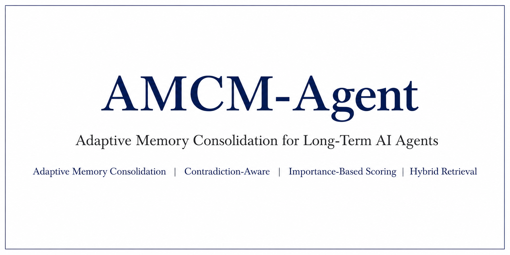
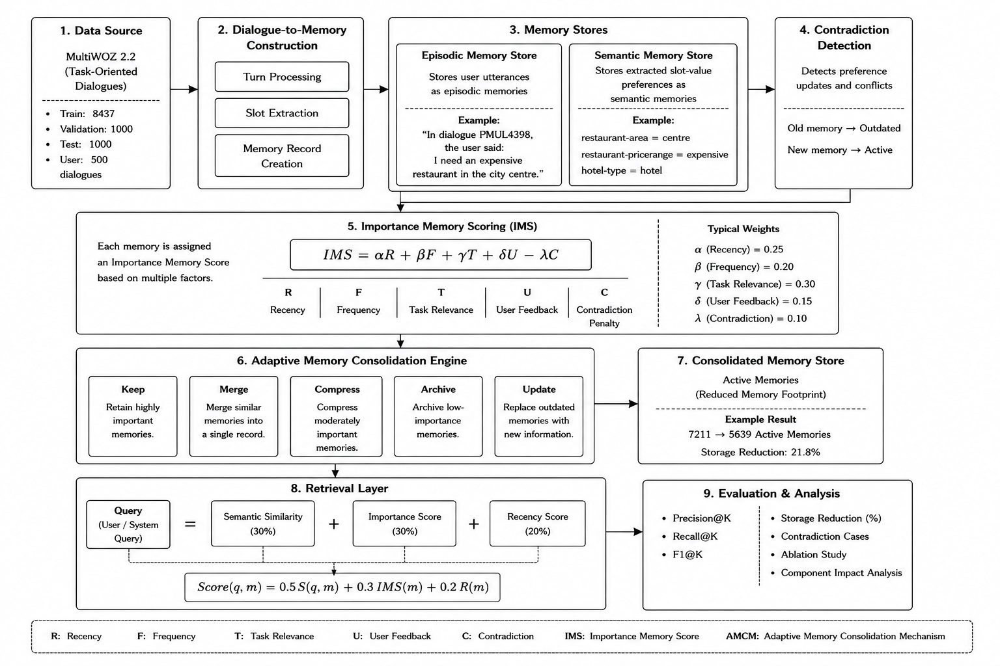
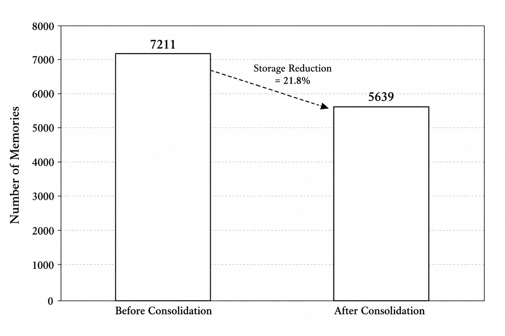
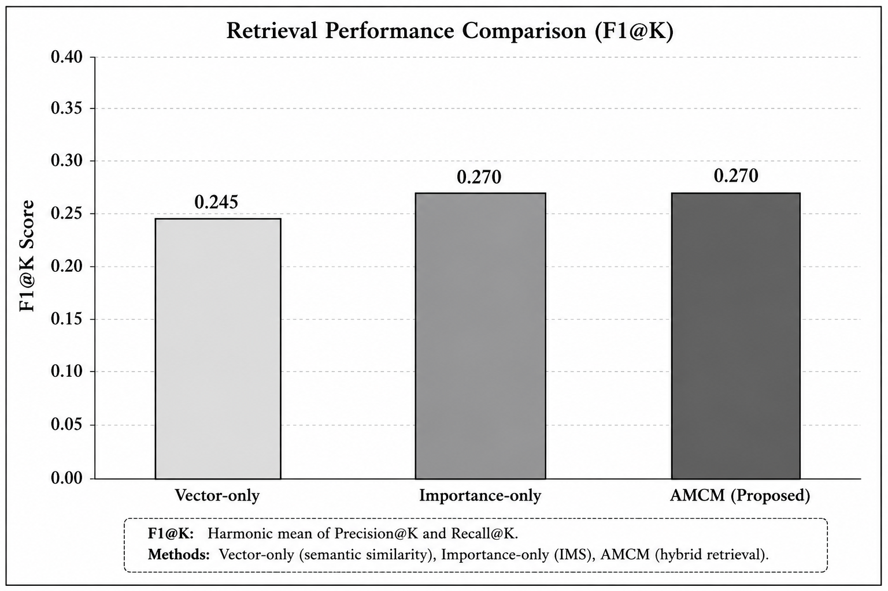
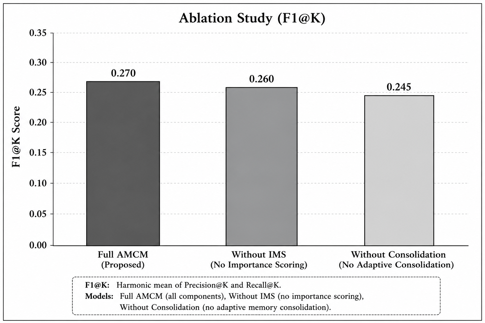

# Adaptive Memory Consolidation for Long-Term AI Agents
<p align="center">
  
</p>

🚧 Research Project | Manuscript Under Preparation


## Overview

AMCM-Agent is a research-oriented memory management framework designed to improve long-term memory retention and retrieval in AI agents. The framework integrates episodic memory, semantic memory, contradiction-aware memory evolution, importance-based memory scoring, adaptive memory consolidation, and hybrid retrieval mechanisms.

Unlike traditional vector-based memory systems that continuously accumulate information, AMCM-Agent dynamically evaluates memory utility and determines whether memories should be retained, merged, compressed, archived, or updated.

---

## Framework Architecture

<p align="center">
  
</p>


## Framework Components

* Dialogue-to-Memory Construction
* Episodic Memory Representation
* Semantic Memory Representation
* Contradiction Detection
* Importance Memory Scoring (IMS)
* Adaptive Memory Consolidation
* Hybrid Memory Retrieval

---

## Dataset

* MultiWOZ 2.2
* 500 Dialogues Processed

---

## Experimental Results

| Metric                              | Value |
| ----------------------------------- | ----- |
| Total Memories Generated            | 7,211 |
| Episodic Memories                   | 3,448 |
| Semantic Memories                   | 3,763 |
| Contradictions Detected             | 295   |
| Active Memories After Consolidation | 5,639 |
| Memory Reduction                    | 21.8% |
| F1@K Score                          | 0.270 |

---
## Experimental Results

### Memory Consolidation Results

<p align="center">
  
</p>

### Retrieval Performance Comparison

<p align="center">
  
</p>

### Ablation Study

<p align="center">
  
</p>
---

## Key Findings

* Reduced memory footprint by 21.8%
* Identified and managed evolving user preferences
* Improved retrieval performance compared to vector-only retrieval
* Demonstrated effectiveness through ablation studies

---

## Repository Structure

```text
notebooks/
figures/
results/
docs/
src/
```

---

## Research Status

This repository contains the implementation and experimental evaluation of the AMCM-Agent framework.

The associated research manuscript is currently under preparation.


ai
